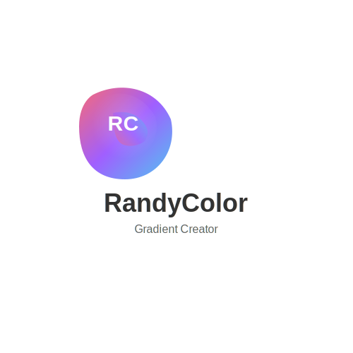
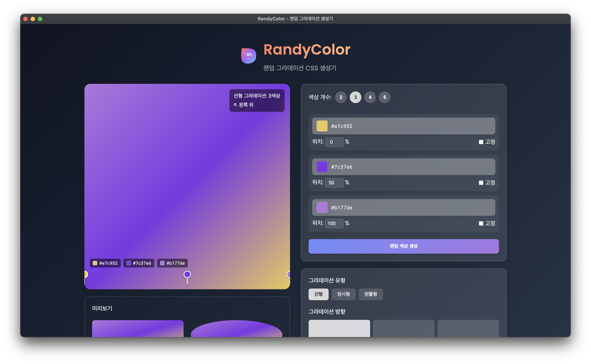
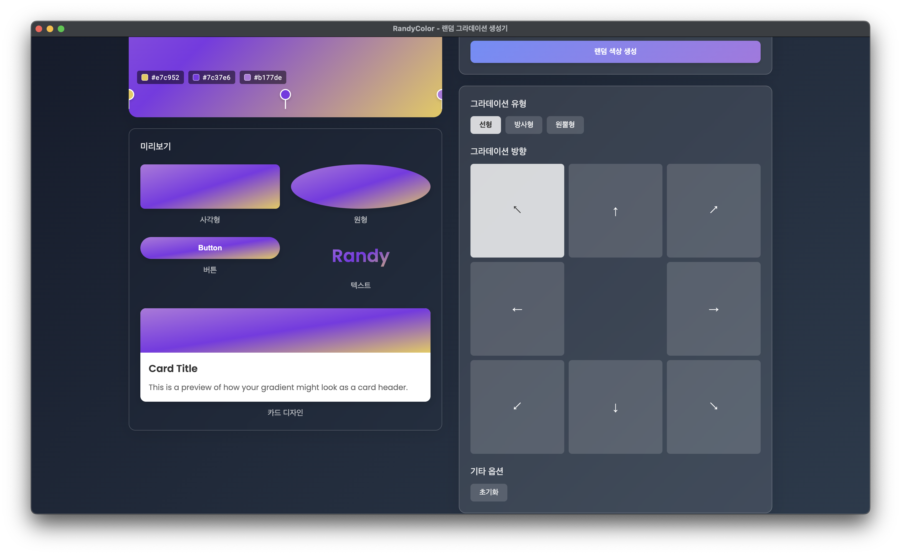

# RandyColor

<div align="center">
  <!-- 로고 이미지 공간 -->
  
  
  <!-- 대표 이미지 공간 -->
  <!-- 대표 이미지는 별도로 추가될 예정입니다 -->
  
  <p>
    <strong>랜덤 그라데이션 CSS 생성기</strong><br>
    데스크탑과 웹에서 모두 사용 가능한 오픈소스 그라데이션 생성 도구
  </p>

  <p>
    <a href="#주요-기능">주요 기능</a> •
    <a href="#설치-방법">설치 방법</a> •
    <a href="#사용법">사용법</a> •
    <a href="#개발-환경-설정">개발 환경 설정</a> •
    <a href="#라이선스">라이선스</a> •
    <a href="#기타">기타</a>
  </p>
</div>

## 소개

RandyColor는 랜덤 색상을 이용한 그라데이션 CSS 코드를 쉽고 빠르게 생성할 수 있는 도구입니다. 직관적인 인터페이스를 통해 색상을 선택하고, 위치를 조정하고, 그라데이션 유형을 변경할 수 있습니다. 생성된 CSS 코드는 즉시 복사하여 프로젝트에 적용할 수 있습니다.

Electron과 Vue.js를 이용하여 개발되었으며, 데스크탑 앱으로 설치하거나 웹 브라우저에서 바로 사용할 수 있습니다.

## 주요 기능

- **랜덤 색상 생성**: 클릭 한 번으로 색상 조합을 무작위로 생성
- **색상 커스터마이징**: 2~5개 색상을 이용한 그라데이션 생성
- **색상 고정 기능**: 선택한 색상을 고정하고 다른 색상만 변경 가능
- **위치 조정**: 드래그 앤 드롭으로 각 색상의 위치를 자유롭게 조정
- **다양한 그라데이션 유형**: 선형, 방사형, 원뿔형 그라데이션 지원
- **코드 포맷 옵션**: HEX, RGB, RGBA 등 다양한 형식의 CSS 코드 생성
- **실시간 미리보기**: 변경 사항을 즉시 확인 가능
- **코드 복사**: 생성된 CSS 코드를 클립보드에 바로 복사

## 스크린샷





## 설치 방법

### 데스크탑 앱으로 설치

1. [릴리즈 페이지](https://github.com/shinkeonkim/randycolor/releases)에서 최신 버전을 다운로드하세요.
2. 운영체제에 맞는 설치 파일을 실행하세요:
   - **macOS**: `.dmg` 파일을 열고 응용 프로그램 폴더에 드래그하세요.
   - **Windows**: `.exe` 파일을 실행하고 설치 과정을 따르세요.
   - **Linux**: `.AppImage` 파일을 실행하거나 `.deb` 패키지를 설치하세요.

### 웹 버전 사용

브라우저에서 [https://randycolor.yourdomain.com](https://randycolor.yourdomain.com)에 접속하여 바로 사용할 수 있습니다.

## 사용법

1. **색상 생성하기**
   - '랜덤 색상 생성' 버튼을 클릭하여 새로운 색상 조합을 만듭니다.
   - 색상 개수 조절: 슬라이더를 이용해 2~5개 사이의 색상 개수를 설정합니다.

2. **색상 수정하기**
   - 색상 칩을 클릭하여 수동으로 색상을 변경합니다.
   - 색상 옆의 체크박스를 선택하여 해당 색상을 고정합니다.

3. **위치 조정하기**
   - 색상 마커를 드래그하여 그라데이션에서의 위치를 조정합니다.
   - 퍼센트 입력란에 직접 수치를 입력할 수도 있습니다.

4. **그라데이션 유형 선택하기**
   - '선형', '방사형', '원뿔형' 옵션 중에서 선택합니다.
   - 선형 그라데이션의 경우 방향도 선택할 수 있습니다.

5. **CSS 코드 복사하기**
   - 원하는 코드 형식(HEX, RGB, RGBA)을 선택합니다.
   - '복사' 버튼을 클릭하여 클립보드에 복사합니다.

## 개발 환경 설정

직접 프로젝트를 빌드하고 실행하려면 다음 단계를 따르세요:

### 필수 조건

- Node.js 16 이상
- Yarn 패키지 매니저

### 설치 및 개발 서버 실행

```bash
# 저장소 클론
git clone https://github.com/yourusername/randycolor.git
cd randycolor

# 의존성 설치
yarn install

# 개발 모드로 실행
yarn electron:dev
```

### 빌드하기

```bash
# 프로덕션 빌드
yarn electron:build
```

빌드된 파일은 `dist_electron` 디렉토리에 생성됩니다.

## 기술 스택

- **프론트엔드**: Vue.js 3, TypeScript
- **스타일링**: CSS3 (커스텀 스타일링)
- **데스크탑 앱**: Electron
- **빌드 도구**: Vite, Electron Builder

## 기여하기

프로젝트에 기여하고 싶으시다면:

1. 이 저장소를 포크하세요
2. 새 브랜치를 만드세요 (`git checkout -b feature/amazing-feature`)
3. 변경 사항을 커밋하세요 (`git commit -m 'Add some amazing feature'`)
4. 브랜치에 푸시하세요 (`git push origin feature/amazing-feature`)
5. Pull Request를 열어주세요

## 라이선스

이 프로젝트는 MIT 라이선스 하에 배포됩니다. 자세한 내용은 [LICENSE](LICENSE) 파일을 참조하세요.

## 연락처

질문이나 피드백이 있으시면 [이슈 트래커](https://github.com/shinkeonkim/randycolor/issues)에 등록해 주세요.

## 기타 사항

- 해당 App 코드의 90% 이상은 Claude3.7 Sonnet으로 작성되었습니다.
